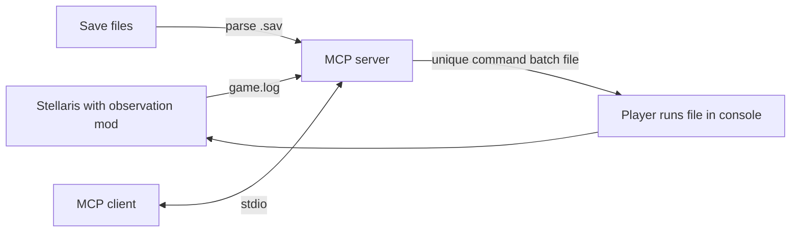

# Stellaris MCP Server

MCP (Model Context Protocol) server that lets an assistant read snapshots from **Stellaris** (Paradox Interactive) and prepare console command batches. The companion mod targets **Cygnus 4.5.x**; its scripts have been checked against 4.5.1 engine documentation. Runtime telemetry and the current save schema still require validation with a fresh campaign. Successful compilation is not proof of in-game compatibility.

## Architecture

The system has three components:



1. **Stellaris Mod** (`mod/`) — PDXScript mod that reports player state on game start, single-player save load and a global monthly pulse. The global pulse also covers player country types without country pulses, including Fallen Empires.
2. **Save File Parser** (`src/parser/`) — Uses the [jomini](https://github.com/nickbabcock/jomini) npm package to parse `.sav` files (ZIP archives containing Clausewitz-format text).
3. **MCP Server** (`src/index.ts`) — stdio-transport MCP server exposing tools for the AI to read state and queue commands.

### Key Constraint

This bridge observes the game through save files and `game.log`. It has no automatic command executor or execution acknowledgement. Each command batch gets a unique `ai_commands_<uuid>.txt` file; the player executes the exact returned `run <filename>` command in the console. Writing a batch does not execute it. Running the same file again repeats its actions.

## MCP Tools

| Tool | Description |
|------|-------------|
| `get_game_state` | Dated, partial snapshot from a save or monthly log, with source and diagnostics |
| `get_resources` | Stockpiles and net monthly balances; preserves extra resource IDs found in saves |
| `get_planets` | Owned planets with pops, stability, buildings, districts, crime, jobs |
| `get_fleets` | Fleet composition, military power, location |
| `get_technologies` | Active research and completed tech from the latest save; logs report research output only |
| `get_diplomacy` | Available diplomatic records; monthly logs cover contacted default empires, saves may include unexplored countries |
| `execute_command` | Queue a single console command |
| `execute_effect` | Queue a PDXScript effect command |
| `queue_commands` | Queue multiple console commands at once |
| `list_save_profiles` | List available save game profiles |
| `analyze_situation` | Snapshot plus advice instructions; optional `style="fallen_empire"` |

## Mod Data Export

The mod writes to `game.log` every month with pipe-delimited lines:

| Prefix | Data |
|--------|------|
| `AI_SUMMARY` | Date, empire name, planets, pops, navy used/cap, military power |
| `AI_RESOURCES` | Per-resource stockpile and monthly income |
| `AI_PLANET` | Per-planet: name, class, pops, size, stability, amenities, housing, jobs, crime |
| `AI_FLEET` | Per-fleet: name, ships, power, MIA status |
| `AI_DIPLO` | Per-empire: name, opinion, rival/pact/war status |
| `AI_TECH_OUTPUT` | Physics/society/engineering research output |
| `AI_STATE_END` | End-of-dump marker |

## Setup

### Prerequisites

- Node.js 20.19+ (required by Chokidar 5; tested locally with Node 24)
- Stellaris (non-ironman for console commands; save parsing works with ironman too)

### Install

```bash
# Clone and install dependencies
git clone https://github.com/megidragon/stellaris-mcp-interface.git
cd stellaris-mcp-interface
npm ci

# Build
npm run build
```

### Install the Stellaris Mod

```bash
bash scripts/install-mod.sh
```

On Windows, the PowerShell installer resolves the actual Documents folder, including OneDrive redirection:

```powershell
powershell -ExecutionPolicy Bypass -File scripts/install-mod.ps1
# Optional override:
powershell -ExecutionPolicy Bypass -File scripts/install-mod.ps1 -StellarisDocuments 'D:\Games\StellarisUserData'
```

Or manually copy the `mod/` contents to:
```
Documents/Paradox Interactive/Stellaris/mod/ai_player_mcp/
```

And create `Documents/Paradox Interactive/Stellaris/mod/ai_player_mcp.mod`:
```
name="AI Player MCP Bridge"
path="mod/ai_player_mcp"
tags={
    "Utilities"
}
supported_version="4.5.*"
```

Then activate **"AI Player MCP Bridge"** in the Stellaris launcher under Mods.
If Stellaris is already running, it needs to be restarted with this mod enabled; copying files does not activate it in the running process.

### Configure the MCP Server

Add to your Claude Code or Claude Desktop MCP settings:

```json
{
  "mcpServers": {
    "stellaris": {
      "command": "node",
      "args": ["<path-to-project>/dist/index.js"],
      "env": {
        "STELLARIS_SAVE_PROFILE": "ia"
      }
    }
  }
}
```

For Codex, use the TOML example in [examples/codex-config.toml](examples/codex-config.toml) with an absolute path to `dist/index.js`. The [official MCP documentation](https://developers.openai.com/codex/mcp) describes the command, arguments and environment settings.

### Environment Variables

| Variable | Default | Description |
|----------|---------|-------------|
| `STELLARIS_DOCUMENTS_PATH` | Standard/OneDrive Documents discovery | Stellaris user data directory; an explicit override wins |
| `STELLARIS_INSTALL_PATH` | Windows Steam default | Installation path used by the diagnostic command |
| `STELLARIS_SAVE_PROFILE` | _(empty)_ | Optional campaign folder; otherwise searches campaign subdirectories |
| `STELLARIS_ADVISOR_STYLE` | `standard` | Set `fallen_empire` for dormant, defensive advice |

## Usage

### Reading Game State

The AI can call read tools at any time. The returned date describes the snapshot, not necessarily the running game.

- **Save parsing** extracts selected fields from the latest `.sav` file, preserving unknown mod IDs. Missing measurements and unsupported version assumptions appear in diagnostics. Numeric compatibility defaults for missing fields must not be treated as measured zeros.
- **Monthly logs** supply resources, planet/fleet summaries, diplomatic flags and research output. They lack stable planet/fleet IDs, building lists and selected technology names. Invalid/unresolved numeric fields remain unknown.
- **Automatic selection** compares save modification time with the latest complete log report. An explicitly selected save profile uses that profile's save because the global log has no profile identity. `get_game_state(source="log")` explicitly reads the running game's report.

### Sending Commands

1. The AI queues commands via `execute_command`, `execute_effect`, or `queue_commands`
2. Each batch is written atomically to a separate `ai_commands_<uuid>.txt` in the Stellaris user data directory. Earlier batches are preserved, and failed writes keep their queue for retry.
3. In-game, open the console (`~`) and enter the exact `run <filename>` returned by the tool. The game provides no acknowledgement to this server.

Example commands the AI might generate:
```
# Direct console commands
cash 1000
research_technology tech_lasers_2
influence 100

# Effect commands (wrapped automatically)
effect add_resource = { energy = 500 }
effect every_owned_planet = { limit = { free_jobs > 5 } add_building = building_factory_1 }
```

### Testing the Parser

```bash
# Parse all save profiles and print results
npm run test:parser
```

Build and run regression tests, including an MCP stdio client against isolated synthetic snapshots and command directories:

```bash
npm run build
npm test
npm run diagnose
# Or inspect a specific save without changing it:
npm run diagnose -- /absolute/path/to/test.sav
```

`diagnose` reports detected paths, installed version, latest monthly report and save diagnostics. It does not install or activate the mod, edit a save or execute game commands. Synthetic fixtures validate parser behavior, not compatibility with a real 4.5.x save.

For live validation, enable the mod in a fresh non-Ironman single-player test game, save, advance to a new month, then pause. Check `game.log` for a complete `AI_SUMMARY` through `AI_STATE_END` frame and inspect `error.log` for errors mentioning this mod. Compare the MCP resource and naval values with the game UI, then reload the test save to verify initialization. A harmless `help` batch can verify the manual console path; no automated acknowledgement exists.

### Dormant Empire Advice

`STELLARIS_ADVISOR_STYLE=fallen_empire` or `analyze_situation(style="fallen_empire")` asks the assistant to maintain a stable economy, research, reserves and border defenses, avoid routine expansion and identify evidence for an awakening. This is an advice preference. It does not change the empire's country type, automate normal game actions or create an unattended manager.

## Project Structure

```
stellaris-mcp/
├── mod/                                  # Stellaris mod (PDXScript)
│   ├── descriptor.mod
│   ├── common/
│   │   ├── on_actions/                   # Monthly pulse hooks
│   │   └── scripted_effects/             # State dump effects
│   ├── events/                           # ai_player event chain
│   └── localisation/english/
├── src/                                  # MCP Server (TypeScript)
│   ├── index.ts                          # Server entry point + tool definitions
│   ├── config.ts                         # Configuration loading
│   ├── parser/
│   │   ├── types.ts                      # Game state TypeScript interfaces
│   │   ├── save-parser.ts                # .sav file parser (jomini)
│   │   ├── log-parser.ts                 # game.log parser
│   │   └── test-parser.ts               # Parser test script
│   ├── tools/
│   │   └── get-game-state.ts             # State formatting for MCP responses
│   ├── watcher/
│   │   ├── save-watcher.ts               # Autosave directory watcher
│   │   └── log-watcher.ts                # game.log tail watcher
│   └── commands/
│       └── command-writer.ts             # Console command file writer
├── scripts/
│   └── install-mod.sh                    # Mod installer script
├── package.json
└── tsconfig.json
```

## Limitations

- **Manual execution** — this implementation requires the player to run each command batch. An unattended backend manager needs a separate, validated execution bridge.
- **Partial saves** — save formats differ across versions and mods. Legacy 3.x saves have been read locally; fresh 4.5.x campaign coverage remains outstanding. Starbases and some calculated statistics are not extracted reliably.
- **Localization keys** — save files store internal keys (e.g. `%ADJECTIVE%`, `NEW_COLONY_NAME_1`) rather than display names. The game resolves these at runtime.
- **Monthly log frequency** — the mod dumps state once per in-game month. For more frequent updates, use save file parsing with shorter autosave intervals.
- **Non-ironman required** — console commands and the `run` command only work in non-ironman games. Save parsing works with both modes.

## Future Plans

- Validate telemetry and save extraction against fresh 4.5.x campaigns, including actual fleet/planet IDs and current population/district layouts.
- Investigate a local command executor with explicit execution acknowledgements and normal action costs. Save editing and UI automation are not implemented by this bridge.
